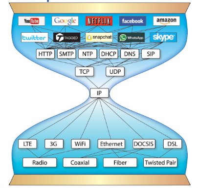

# IPv6

## Lecture Notes: IPv6

### Why IPv6?

* IPv4's 32-bit addresses do not scale to the current size of the Internet
* push for more features within IP
  * a mechanism for carrying real-time traffic to avoid route changes
  * ability to work with multiple peer servers
  * provide capability for using shared resources
* why Version 6
  * IPv5, or ST, was developed as a streaming protocol
  * addresses still only 32 bits
  * abandoned before it ever became a standard

### IP and Change

<figure><figcaption></figcaption></figure>

* scarcity of available addresses was considered crucial when work began on a new version of IP in 1993
  * no emergency occurred
  * IP has not been changed
* networking professionals argue that Internet communication follows an hourglass model
  * IP lies at the position where the hourglass is narrow

### IPv4 vs IPv6

* similarities:
  * IPv6 is still connectionless
  * IPv6 packets still self-destruct after crossing a certain number of routers
* differences:
  * 32 bit vs. 128 bit addresses
  * almost every field in the header has been changed from v4 to v6
    * rather than include fields in the standard header to handle any specific issue that might occur, IPv6 uses a standard header and deals with any optional IP data via extension headers
    * the standard IPv6 header is 40 bytes long
      * constant format, fixed size
      * twice as large as the standard IPv4 header, but with fewer fields (source and destination address take up far more space)
    * consistent size designed to reduce processing time at the destination and on intervening routers
    * IPv6 fields:
      * version (6)
      * traffic class
      * flow label (to associate a packet with a particular path)
      * payload length
      * hop limit (replacement for TTL)
      * next header
  * IPv6 defines a set of special addresses that differ from IPv4 special addresses
    * IPv6 does not include a special address for broadcasting on a given remote network

### IPv6 Addressing

* IP supports the following services:
  * unicast: one-to-one
  * broadcast: one-to-all (only in v4)
  * multicast: one-to-several
  * anycast: one-to-nearest of a group (only in v6)

### IPv6 Notation

* colon hexadecimal notation
  * each group of 16 bits is written in hexadecimal, with a colon separating each group
  * 8 groups in total
* shortening options
  * leading zeros can be omitted from each group
    * ex. 0030 becomes 30
  * a double colon can be used ONCE in an address to replace multiple fields of zeros (zero compression)
    * ex. xxxx:0:0:0:xxxx.... becomes xxxx::xxxx

### IPv6 Subnetting

* addresses are typically composed of two logical parts:
  * a 64-bit network prefix used for routing (network ID)
    * 48 bits for the assigned "routing prefix", 16 bits for subnetting
  * 64-bit interface identifier used to identify a host (host ID)
* for subnet masks, CIDR is the preferred representation
  * ex. /24 means 24 bits for the network address and 104 for the host
* IPv6 uses 128 bits to represent an address which includes bits to be used for subnetting- the second half of the address (least significant 64 bits) is always used for hosts only, so there's no compromise if we subnet the network
* 16 bits of subnet is equal to  IPv4's Class B network
  * using these subnet bits, an organization can have another 65 thousand subnets
* can further subnet the network beyond 16 bits of subnet ID by borrowing host bits, but it is recommended that 64 bits should always be used for host addresses because auto-configuration requires 64 bits
* IPv4 subnetting works on the same concept as variable length subnet masking in IPv4

### Address Format and Allocations

* IPv6
  * requires each single interface within each device to have its own unique interface identifier (typically the second 64 bits)
  * specifies that interface identifiers can use the "modified EUI-64 format"- essentially the host sets its own "interface identifier"
  * these can be created using different methods:
    * use of 48-bit MAC address in the 64-bit ID (SLAAC)
    * use of existing IPv4 address in the 64-bit ID
    * link-local- equivalent to Windows default IP addressing
      * fe80::/10 usually implemented as fe80::/64
      * random number

### Stateless Address Autoconfiguration

* IPv6 does not use DHCP
* instead, we can built our own IPv6 address:
  * get the network ID from the router
  * generate our own host ID (usually via our MAC address)
* but MAC addresses are only 48 bits
  * add FFFE between the OUI and the unique identifier to create a 64-bit host ID
  * the seventh bit in the OUI becomes 1
