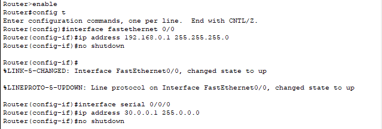
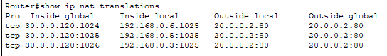

# Network Address Translation

## Lecture Notes: NAT

### What is NAT?

* we've run out of public IPv4 addresses to assign
  * lots of networks use private addresses instead
    * 10.0.0.0/8, 172.16.0.0/12, 192.168.0.0/16
  * private addresses are not routable on the Internet
* NAT is a method of remapping one IP address space into another
* we do this by modifying network address information in IP packet headers while they are in transit across a router
* the general rule is clients make outbound connections, so they can share public IPs
  * a NAT router will track these transactions to make sure reply packets go to the right place
* NAT can also provide some security
  * hosts using private IPs cannot typically be directly accessed from outside the network

### NAT Routers

* functions necessary for NAT routers:
  * rewrite layer 3 header
    * source IP rewrite for outbound packets
      * private IP to public IP
    * destination IP rewrite for inbound packets
      * public IP to private IP
  * keep track of translations in a table so it knows how to send inbound packets back to the right client
    * may also require rewriting layer 4 headers
    * source port TCP/UDP often used to track translations
* devices performing NAT are in between the sender and the receiver
  * will rewrite the layer 3 (and often layer 4) headers as a packet travels between the sender and the receiver

### IP Masquerading

* in IP masquerading, the private source IP address that is changed into a public address as the "new" source address of the outgoing IP packet
  * enables communication through the router only when the conversation originates inside the masqueraded network
* masquerading routers keep stateful translation tables of each conversation to "remember" the original source address when packets return during this conversation
  * the translation tables are flushed after a defined period unless new traffic refreshes their state to prevent port exhaustion and free state table resources

### Types of NAT

* static NAT
  * one to one IP mapping
  * port forwarding
* port address translation (PAT)
  * many to one IP mapping
  * IP masquerading
* dynamic NAT
  * many to many IP mapping

### Static NAT

* allows the network administrator to configure translation table entries for permanent use
* this feature is often referred to as port forwarding and allows traffic originating in the "outside" network to reach designated hosts in the masqueraded network
* simple to configure
* useful to allow access to a few servers, hosts, or applications
* does not scale well, as each entry has to be manually configured

### Dynamic NAT

* maps unregistered private IP addresses to registered public IP addresses by selecting a public IP from a pool of registered IP addresses
  * many to many mapping
* dynamic NAT is used when PAT is not supported
  * some hardware and protocols don't support PAT
* dynamic NAT has limitations:
  * public pool has is smaller than the # of private IPs
  * pool can get used up
  * clients have to wait for a public IP
  * can still use many public IPs

### Port Address Translation

* PAT is a common implementation of IP masquerading NAT
  * permits multiple devices on a local area network to be mapped to a single public IP address
* PAT devices use the source TCP port number as a way to keep track of different sessions
  * usually picked randomly anyway
* can track the mapping between the original IP/port and the new IP/port

### Wildcard Subnet Masks

* another way to write a subnet mask
* flips the ones and zeros
* ex. 255.255.255.0 becomes 0.0.0.255

## Lab Notes: NAT Configuration

### Static NAT

```
Router> enable
Router# config t
Router(config)# hostname [hostname]
Router(config)# interface [interface name]
Router(config-if)# ip nat inside
Router (config-if)# interface [interface name]
Router(config-if)# ip nat outside
Router(config-if)# exit
Router(config)# ip nat inside source static [inside interface IP]
```

#### Configuring Router 0

<figure><figcaption></figcaption></figure>

<figure><figcaption></figcaption></figure>

#### Configuring Router 1

<figure><figcaption></figcaption></figure>

### PAT

#### Router 1 Configuration

<figure><figcaption></figcaption></figure>

<figure><figcaption></figcaption></figure>

#### Router 2 Configuration

<figure><figcaption></figcaption></figure>

#### IP Nat Table on R1

<figure><figcaption></figcaption></figure>

### Champlain Example Lab

* Foster PCs are 192.168.3.100-101
* Ireland servers are 192.168.7.100-101
* Skiff PCs are 192.168.1.100-101
* BT server is 192.168.18.100

#### CC Border Router (PAT)

```
enable
config t
ip route 0.0.0.0 0.0.0.0 [public default gateway address- ex. BT router, 219.93.144.2]
interface fastethernet 0/0
ip nat inside
interface fastethernet 0/1
ip nat outside
access-list 1 permit 192.168.1.0 0.0.0.255
access-list 1 permit 192.168.3.0 0.0.0.255
ip nat pool test [public IP start range, ex. 219.93.144.100] [public IP end range, ex. 219.93.144.100] netmask [netmask, ex. 255.255.255.0]
ip nat inside source list 1 pool test overload
```

<figure><figcaption><p>BT Router</p></figcaption></figure>
