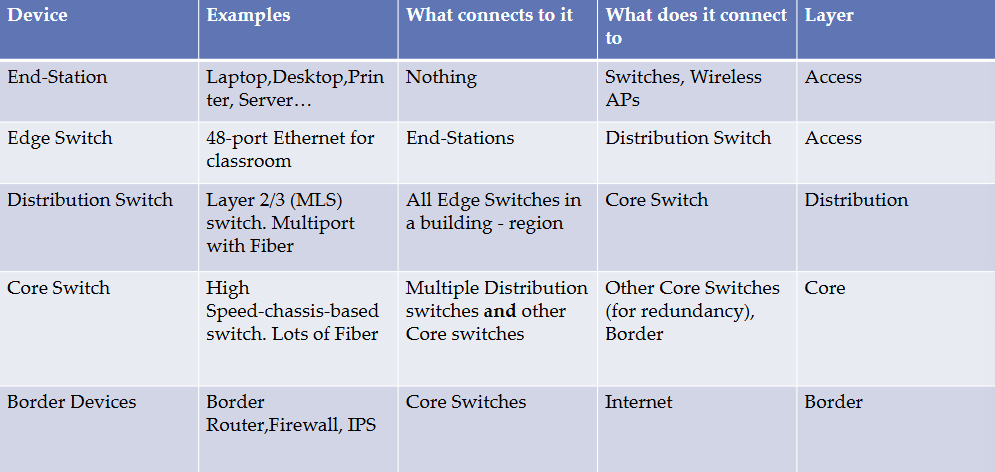

# Network Design Layers

## Lecture Notes: Hierarchical Internetworking Model

* multi-tier architecture divides enterprise networks into three or four layers:
  * border (not in all architectures)
    * connect to Internet (routing/layer 3)
  * core
    * dumb and fast (switching/layer 2)
  * distribution
    * smart (routing/layer 3)
  * access/edge
    * wireless APs and switches
    * access VLANs (layer 2)
* access/edge layer
  * end stations and servers connect to the enterprise at the access layer
  * access layer devices are usually commodity switching platforms (aka switches and wireless access points)
  * also called the desktop layer because it focuses on connecting client nodes, such as workstations to the network
  * layer 2 technology like VLANs
* distribution layer
  * the distribution layer is the smart layer in the three-layer model
  * routing, filtering (internal firewalling), and QoS policies are managed at the distribution layer
  * distribution layer devices also often manage individual branch-office WAN connections
  * typically handled by multi-layer switches (switches that route)
* core layer
  * the core network provides high-speed, highly redundant forwarding services to move packets between distribution layer devices in different regions of the network
  * core switches and routers are usually the most powerful in terms of raw forwarding power
  * core network devices manage the highest-speed connections, such as 10, 40, or 100 gbps
  * however, they typically only do switching (layer 2)
  * often don't need much configuration- just links the distribution layers to each other and the border
  * the network backbone
* border layer
  * the network devices that connect an enterprise network to the Internet
  * routers, border firewall, border load balancers, border IPS, and other security devices
  * layer 3 and up

<figure><figcaption></figcaption></figure>
