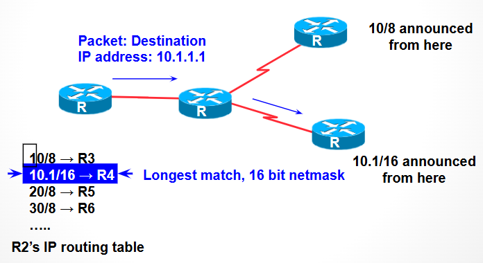
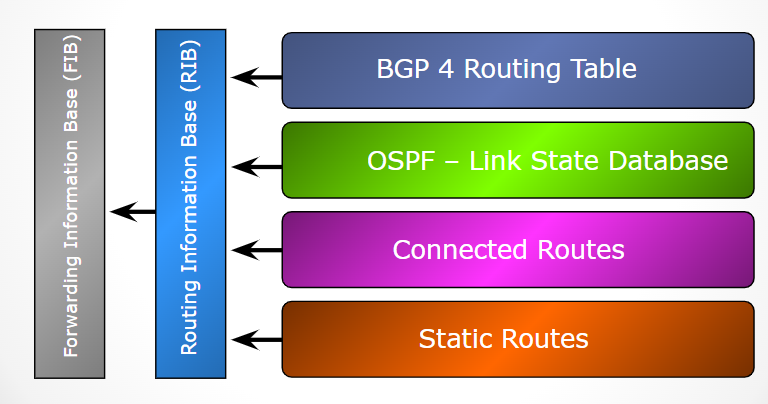

# OSPF

## Lecture Notes: Interior Routing

### Routing vs. Forwarding

* routing: building maps and giving directions
* forwarding: moving packets between interfaces according to "directions"

### IP Routing

* path derived from information received from a routing protocol
* several alternative paths may exist
  * best path stored in forwarding table
* decisions are updated periodically or as topology changes (event driven)
* decisions are based on:
  * topology
  * policies
  * metrics (hop count, filtering, delay, bandwidth, etc.)

### IP Route Lookup

<figure><figcaption></figcaption></figure>

* based on destination IP address
* "longest match" routing
  * more specific prefix preferred over less specific prefix
  * ex. packet with destination of 10.1.1.1/32 is sent to the router announcing 10.1/16 rather than the router announcing 10/8

### IP Forwarding

* router decides which interface a packet is sent to
* forwarding table populated by routing process
* forwarding decisions:
  * destination address
  * class of service (fair queuing, precedence, etc.)
  * local requirements (packet filtering)
* forwarding is usually aided by special hardware

#### Routing and Forwarding Tables

<figure><figcaption></figcaption></figure>

* FIB (forwarding table)
  * contains destinations and the interfaces to get to those destinations
  * used by the router to figure out where to send the packet
  * (still sometimes called a route)
* RIB (routing table)
  * contains a list of all the destinations and the various next hops used to get to those destinations, along with other information
  * one destination can have lots of possible next-hops- only the best next-hop goes into the FIB

## Lab Notes: OSPF in Packet Tracer

### Router Configuration

```
# configure interfaces
Router> enable
Router# config t
Router (config)# interface [interface name]
Router (config-if)# ip address [IP address] [subnet mask]
Router (config-if)# exit
# declare OSPF instance
Router (config)# router ospf [instance ID, can just use 1]
# advertise on area 0 to network (directly connected networks)
Router (config-router)# network [network address] [subnet mask] area 0
# repeat for each network that the router is connected to
# can delete networks by putting "no" in front of the command
```
