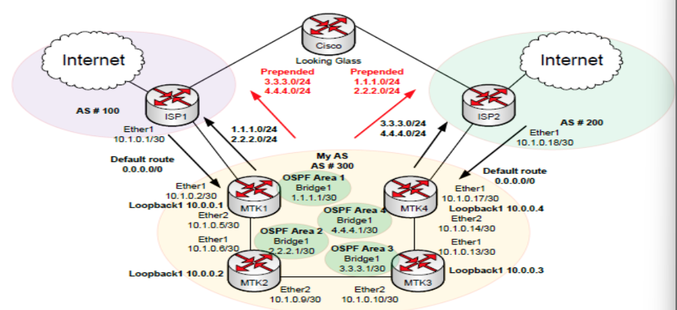
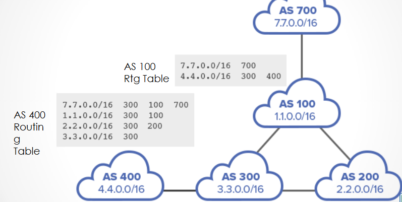
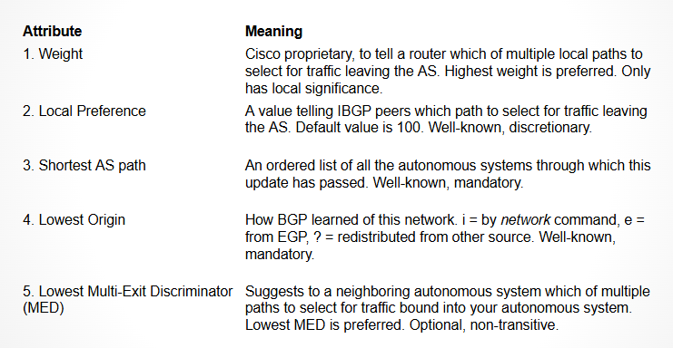
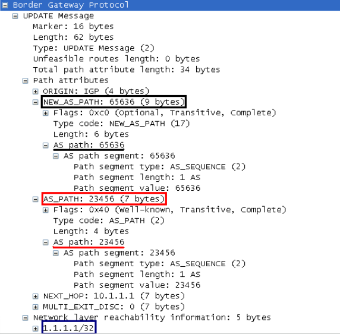

# WAN Routing and BGP

## Lecture Notes: BGP

### BGP: Routing Protocol of the Internet

* Interior Gateway Protocols are responsible for building and updating routing tables within an organization
  * OSPF
  * RIP
* Exterior Gateway Protocols are responsible for building and updating routing tables between organizations across larger internetworks like the Internet
* Border Gateway Protocol (BGP) is the EGP used on the Internet

### BGP Overview

* exchanges routing and reachability information among autonomous systems (AS) on the Internet
* the protocol is classified as a path vector protocol
* makes routing decisions based on paths, network policies, or rule-sets configured by a network administrator
* some very large organizations may also use BGP as an IGP

### Autonomous Systems

* an autonomous system is:
  * a collection of connected Internet Protocol (IP) routing prefixes under the control of a single administrative entity (ex. company, university, ISP) that presents a common, clearly defined routing policy to the Internet

#### AS Numbers

* a unique ASN is allocated to each AS for use in BGP routing
* AS numbers are important because the ASN uniquely identifies each (aggregated) network on the Internet
* IANA handles AS number assignments
* until 2007, AS numbers were defined as 16-bit integers, which allowed for a maximum of 65536 assignments
* now, registries can hand out 32-bit AS numbers (over 4 billion total)
* the number of unique autonomous networks in the routing system of the Internet exceeded 5000 in 1999, and was 118000 in October 2024

### BGP Operation

* BGP neighbors, called peers, are established by manual configuration between routers
* creates a TCP session on port 179
* a BGP speaker sends 19-byte keep-alive messages every 60 seconds to maintain the connection
* among routing protocols, BGP is unique in using TCP as its transport protocol
  * others are their own layer 4 protocols

### BGP Peering

<figure><figcaption></figcaption></figure>

* organizations must "peer" with their ISPs and other networks with which they share an internal link
* this allows for multi-homed networks (multiple connections to the Internet)
* your AS will be advertised through your multiple peers- this allows multiple paths to your IP networks from the Internet
* other routers pick the best "path" to your network

### Path Vector Protocol

<figure><figcaption></figcaption></figure>

* distance vector protocols
  * like RIP- use "distance" as a route selection metric
  * routing table includes how many hops/routers to a remote network
  * only knows IP of next router- not the full path to destination
* Path Vector Protocols- like BGP
  * routing table includes the "path" of AS numbers to get to remote networks

### Best Path Algorithm

* BGP Best Path Selection Algorithm is used to choose and install the best routes into the router's routing table
* the full internet BGP routing table includes over 400000 routes
* BGP router can receive numerous copies of those routes from various providers
  * it has to compare the multiple routing tables and choose the optimal route on the router

### BGP Attributes for Selecting Path

<figure><figcaption></figcaption></figure>

### BGP Update Message

<figure><figcaption></figcaption></figure>

* sent to peers
* includes AS path and IPv4 nets
  * ex. 10.0.0.0/8

### Configuring BGP

* create BGP instance
* identify peer networks by IP address
* identify any networks that the router is responsible to advertise

#### BGP on Cisco

* define router instance
  * router bgp \[AS number for router]
  * router bgp 1010
* identify peers
  * (config-router) neighbor \[IP of peer] remote-as \[AS number of peer]
  * (config-router) neighbor 192.168.1.2 remote-as 2352
* advertise networks
  * (config-router) network 10.10.52.0 mask 255.255.255.0

### Additional Notes

* configuring redistribution of OSPS on border router
* to advertise networks shared through OSPF, the following command must be included in BGP config:
  * "redistribute ospf \[instance number]"
